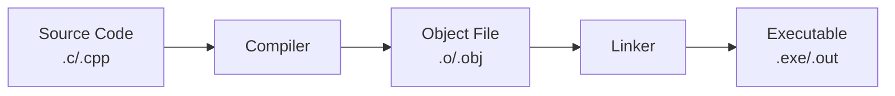
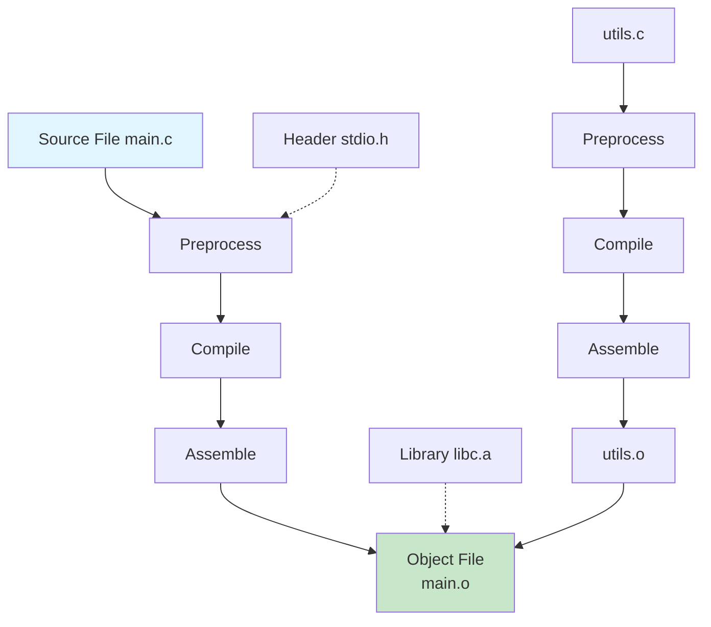

> **Chinese Version**: [编译型语言项目构建指南：以C/C++为例](./README_CN.md)

# Compiled Language Build Guide: A Deep Dive into C/C++ Build Process

> Every time you execute `gcc main.c -o app` or `make`, the compiler performs a series of precise conversion operations behind the scenes. This article takes C/C++ as an example to help you deeply understand the complete build process of compiled languages.
>
> Note: A `CMakeLists.txt` is a project structure file manually authored by developers. CMake serves as a build script generator that generates native project build scripts based on `CMakeLists.txt`. Make is a build utility that invokes compilers, builds the project, and executes other auxiliary operations in accordance with the generated build scripts.

## 1. What is a Compiled Language

A compiled language is a programming language that requires a compiler to translate source code into machine code before execution.

**Representative Languages**: C, C++, Rust, Go



## 2. The Four Stages of Build

### 2.1 Complete Flowchart



### 2.2 Preprocessing Stage

Preprocessing handles directives starting with `#` before compilation.

**Preprocessing Tasks**:

| Task | Directive | Description |
|------|-----------|-------------|
| Macro Expansion | `#define` | Replace all macro definitions |
| Header Inclusion | `#include` | Insert header file content |
| Conditional Compilation | `#if/#ifdef/#endif` | Selective compilation |
| Comment Removal | `//` and `/* */` | Delete all comments |

**Example Demonstration**:

```c
// main.c
#define MAX_SIZE 100
#define DEBUG 1

#include <stdio.h>

int main() {
    // This is a comment
    printf("Max size is: %d\n", MAX_SIZE);
    return 0;
}
```

Run preprocessing:

```bash
gcc -E main.c -o main.i

# View preprocessed result (first 20 lines)
head -20 main.i
```

```c
// After preprocessing
# 1 "main.c"
# 1 "<built-in>"
# 1 "<command-line>"
...

# 1 "main.c" 2

typedef __builtin_va_list __gnuc_va_list;
typedef __gnuc_va_list va_list;

extern int printf (const char *__restrict__, ...);
int main() {
    printf("Max size is: %d\n", 100);
    return 0;
}
```

### 2.3 Compilation Stage

The compiler converts preprocessed code into assembly language.

```bash
# Generate assembly from preprocessed file
gcc -S main.i -o main.s

# Or one-step preprocess + compile
gcc -S main.c -o main.s
```

**Assembly File Example** (main.s):

```asm
    .file   "main.c"
    .text
    .def    __mingw_main;    .scl    2;  .type   32; .endef
    .globl  main
    .def    main;           .scl    2;  .type   32; .endef
    .seh_proc   main
main:
    pushq   %rbp
    .seh_pushreg   %rbp
    movq    %rsp, %rbp
    .seh_setframe  %rbp, 0
    subq    $32, %rsp
    .seh_allocstack 32
    ...

    leaq    .LC0(%rip), %rcx
    movl    $100, %edx
    call    printf
    xorl    %eax, %eax

    addq    $32, %rsp
    popq    %rbp
    ret
    .seh_endproc
```

### 2.4 Assembly Stage

The assembler converts assembly code into machine code, generating object files.

```bash
# Generate object file from assembly
gcc -c main.s -o main.o

# Or one-step compile + assemble
gcc -c main.c -o main.o
```

**Object File Structure**:

```
+------------------+
|  File Header     |  File type, machine architecture
+------------------+
|  Symbol Table    |  Function and variable definitions
+------------------+
|  Relocation Table|  Positions to process at link time
+------------------+
|  .text Section   |  Machine instructions
+------------------+
|  .data Section   |  Initialized global variables
+------------------+
|  .bss Section    |  Uninitialized global variables
+------------------+
```

### 2.5 Linking Stage

The linker combines multiple object files and libraries into the final executable.

```bash
# Link single object file
gcc main.o -o main

# Link multiple object files
gcc main.o utils.o -o app

# Link static library
gcc main.o -L/usr/lib -lm -o main

# Link dynamic library
gcc main.o -lpthread -o main
```

**Linking Types Comparison**:

| Type | Static Linking | Dynamic Linking |
|------|-----------------|------------------|
| Library Code | Embedded in executable | Loaded at runtime |
| File Size | Larger | Smaller |
| Updates | Requires recompilation | Library can be updated separately |
| Startup | Faster | Slightly slower |

## 3. One-Step Build

In practice, you typically complete all stages in one step:

```bash
# Simple build
gcc main.c -o main

# With debug info
gcc -g main.c -o main_debug

# Optimized build
gcc -O2 main.c -o main_optimized

# With all warnings
gcc -Wall -Wextra main.c -o main
```

**Common Compiler Options**:

| Option | Description | Example |
|--------|-------------|---------|
| `-o` | Specify output filename | `-o app` |
| `-c` | Compile only, no linking | `-c main.c` |
| `-g` | Generate debug info | `-g main.c` |
| `-O[n]` | Optimization level | `-O2 main.c` |
| `-Wall` | Enable all warnings | `-Wall main.c` |
| `-I` | Add header search path | `-I./include` |
| `-L` | Add library search path | `-L./lib` |
| `-l` | Specify library to link | `-lm` (math) |

## 4. Multi-File Project Build

### 4.1 Project Structure

```
project/
├── include/
│   ├── utils.h
│   └── config.h
├── src/
│   ├── main.c
│   ├── utils.c
│   └── config.c
├── lib/
│   └── libcustom.a
└── build/
```

### 4.2 Separating Headers and Source Files

```c
// include/utils.h
#ifndef UTILS_H
#define UTILS_H

// Function declarations
int add(int a, int b);
int multiply(int a, int b);
void print_result(int result);

#endif
```

```c
// src/utils.c
#include "utils.h"

int add(int a, int b) {
    return a + b;
}

int multiply(int a, int b) {
    return a * b;
}

void print_result(int result) {
    printf("Result: %d\n", result);
}
```

```c
// src/main.c
#include "utils.h"

int main() {
    int sum = add(5, 3);
    int product = multiply(4, 6);
    
    print_result(sum);
    print_result(product);
    
    return 0;
}
```

### 4.3 Manual Multi-File Compilation

```bash
# Compile all source files
gcc -c src/main.c -o build/main.o -I./include
gcc -c src/utils.c -o build/utils.o -I./include

# Link to generate executable
gcc build/main.o build/utils.o -o build/app

# Or one-step
gcc src/*.c -I./include -o build/app
```

## 5. Build Management with Makefile

Makefile is the standard tool for managing builds of large projects, automatically tracking dependencies and recompiling only modified parts.

### 5.1 Basic Makefile

```makefile
# Variable definitions
CC = gcc
CFLAGS = -Wall -g -I./include
TARGET = app
SRCS = src/main.c src/utils.c
OBJS = $(SRCS:.c=.o)

# Default target
all: $(TARGET)

# Link to generate executable
$(TARGET): $(OBJS)
    $(CC) $(CFLAGS) -o $@ $^

# Compile rule: .c -> .o
%.o: %.c
    $(CC) $(CFLAGS) -c $< -o $@

# Clean
clean:
    rm -f $(OBJS) $(TARGET)

# Phony targets
.PHONY: all clean
```

**Makefile Variables**:

| Variable | Description | Example |
|----------|-------------|---------|
| `$@` | Target filename | `app` |
| `$<` | First dependency | `main.c` |
| `$^` | All dependencies | `main.o utils.o` |

### 5.2 Advanced Makefile

```makefile
# ==================== Configuration ====================
CC = gcc
CXX = g++
CFLAGS = -Wall -Wextra -O2
CXXFLAGS = -std=c++17 $(CFLAGS)
LDFLAGS = -L./lib
LDLIBS = -lm -lpthread

# Directories
SRC_DIR = src
INC_DIR = include
OBJ_DIR = build
BIN_DIR = bin

# Sources, Objects, Executable
SOURCES = $(wildcard $(SRC_DIR)/*.c)
OBJECTS = $(SOURCES:$(SRC_DIR)/%.c=$(OBJ_DIR)/%.o)
TARGET = $(BIN_DIR)/app

# ==================== Rules ====================
.PHONY: all clean rebuild test install

all: $(TARGET)
    @echo "Build complete: $(TARGET)"

$(TARGET): $(OBJECTS) | $(BIN_DIR)
    $(CC) $(LDFLAGS) -o $@ $^ $(LDLIBS)

$(OBJ_DIR)/%.o: $(SRC_DIR)/%.c | $(OBJ_DIR)
    $(CC) $(CFLAGS) -I$(INC_DIR) -c $< -o $@

$(OBJ_DIR):
    mkdir -p $(OBJ_DIR)

$(BIN_DIR):
    mkdir -p $(BIN_DIR)

clean:
    rm -rf $(OBJ_DIR) $(BIN_DIR)

rebuild: clean all

test: $(TARGET)
    @echo "Running tests..."
    ./$(TARGET)

install: $(TARGET)
    cp $(TARGET) /usr/local/bin/
    @echo "Installation complete"
```

### 5.3 Makefile Usage

```bash
# Basic build
make

# Clean and rebuild
make rebuild

# Build only modified files
make

# Clean
make clean
```

## 6. Build with CMake

CMake is a cross-platform build system that generates native build files (Makefile, Visual Studio projects, etc.) for different platforms.

### 6.1 Basic CMakeLists.txt

```cmake
# Minimum CMake version
cmake_minimum_required(VERSION 3.20)

# Project information
project(MyApp VERSION 1.0.0 LANGUAGES C)

# Set C standard
set(CMAKE_C_STANDARD 11)
set(CMAKE_C_STANDARD_REQUIRED ON)

# Find source files
file(GLOB SOURCES "${CMAKE_SOURCE_DIR}/src/*.c")

# Create executable
add_executable(${PROJECT_NAME} ${SOURCES})

# Include header directories
target_include_directories(${PROJECT_NAME} PRIVATE
    ${CMAKE_SOURCE_DIR}/include
)

# Compile options
target_compile_options(${PROJECT_NAME} PRIVATE
    -Wall -Wextra -O2
)

# Link libraries
target_link_libraries(${PROJECT_NAME} PRIVATE
    m pthread
)
```

### 6.2 Advanced CMakeLists.txt

```cmake
cmake_minimum_required(VERSION 3.20)
project(MyApp VERSION 1.0.0)

# ==================== Configuration ====================
set(CMAKE_C_STANDARD 11)
set(CMAKE_RUNTIME_OUTPUT_DIRECTORY ${CMAKE_BINARY_DIR}/bin)
set(CMAKE_LIBRARY_OUTPUT_DIRECTORY ${CMAKE_BINARY_DIR}/lib)

# Find packages
find_package(OpenSSL REQUIRED)
find_package(Threads REQUIRED)

# ==================== Sources ====================
include_directories(${CMAKE_SOURCE_DIR}/include)

add_subdirectory(src/utils)
add_subdirectory(src/main)

# Main program
add_executable(${PROJECT_NAME}
    src/main/main.c
)

# ==================== Linking ====================
target_link_libraries(${PROJECT_NAME}
    utils
    OpenSSL::SSL
    OpenSSL::Crypto
    Threads::Threads
)

# ==================== Installation ====================
install(TARGETS ${PROJECT_NAME}
    RUNTIME DESTINATION bin
)

install(DIRECTORY ${CMAKE_SOURCE_DIR}/config/
    DESTINATION etc/${PROJECT_NAME}
)
```

### 6.3 Modular CMakeLists.txt

```cmake
# src/utils/CMakeLists.txt
add_library(utils STATIC
    utils.c
    math_utils.c
    string_utils.c
)

target_include_directories(utils PUBLIC
    ${CMAKE_SOURCE_DIR}/include
)
```

### 6.4 CMake Build Process

```bash
# Create build directory (not recommended in source tree)
mkdir build && cd build

# Configure project
cmake .. -DCMAKE_BUILD_TYPE=Release

# Build
cmake --build .

# Or use make
make

# Install
cmake --install .

# Clean
rm -rf build
```

## 7. Common Issues and Solutions

### 7.1 Compilation Errors

| Error | Cause | Solution |
|-------|-------|----------|
| `undefined reference to 'xxx'` | Function definition not found at link time | Add corresponding `.o` file or library |
| `No such file or directory` | Header path error | Use `-I` to add path |
| `implicit declaration` | Function not declared or header not included | Add function declaration |
| `undefined symbol` | Wrong library version linked | Check library version |

### 7.2 Linking Errors

```bash
# Common linking libraries
-lm          # Math library libm.so
-lpthread    # Thread library
-lssl        # OpenSSL
-lcrypto     # OpenSSL crypto
-lcurl       # libcurl
```

### 7.3 Debugging Tips

```bash
# View detailed compilation commands
make VERBOSE=1

# View symbol table
nm main.o
readelf -s main.o

# View dynamic library dependencies
ldd app
otool -L app  # macOS

# View library contents
ar -t libutils.a
```

## 8. Best Practices

### 8.1 Project Organization

```
project/
├── CMakeLists.txt
├── Makefile
├── README.md
├── LICENSE
├── include/           # Header files
│   ├── utils.h
│   └── config.h
├── src/              # Source code
│   ├── main.c
│   ├── utils.c
│   └── tests/
├── lib/              # Third-party libraries
├── build/            # Build output (not committed to git)
└── .gitignore
```

### 8.2 .gitignore Example

```
# Build artifacts
build/
*.o
*.a
*.so
*.dylib
app
*.exe

# IDE
.vscode/
.idea/

# CMake
CMakeFiles/
CMakeCache.txt
cmake_install.cmake
```

### 8.3 Build Script

```bash
#!/bin/bash
# build.sh - Cross-platform build script

set -e

# Colors
RED='\033[0;31m'
GREEN='\033[0;32m'
NC='\033[0m'

build() {
    echo -e "${GREEN}[BUILD]${NC} Starting build..."
    
    if [ -d "build" ]; then
        rm -rf build
    fi
    mkdir -p build
    
    cd build
    cmake .. -DCMAKE_BUILD_TYPE=Release
    cmake --build . -j$(nproc)
    
    echo -e "${GREEN}[DONE]${NC} Build successful!"
}

clean() {
    echo -e "${RED}[CLEAN]${NC} Cleaning build directory..."
    rm -rf build
}

"$@"
```

## 9. Summary

### Build Process Review

```
Source Code (.c) → Preprocess → Compile → Assemble → Link → Executable
```

| Stage | Input | Output | Tool |
|-------|-------|--------|------|
| Preprocess | `.c` + `.h` | `.i` | cpp |
| Compile | `.i` | `.s` | gcc/cc |
| Assemble | `.s` | `.o` | as |
| Link | `.o` | Executable | ld |

### Key Takeaways

1. **Understand the Four Stages**: Preprocessing, compilation, assembly, and linking are all essential
2. **Use Makefile**: The preferred solution for managing complex projects
3. **CMake for Cross-Platform**: Standard build system for large projects
4. **Use Tools Wisely**: Make good use of `-Wall`, debug symbols, and linking options

---

## References

1. [GCC Manual](https://gcc.gnu.org/onlinedocs/gcc/)
2. [GNU Make Manual](https://www.gnu.org/software/make/manual/)
3. [CMake Tutorial](https://cmake.org/cmake/help/latest/guide/tutorial/index.html)
4. *Computer Systems: A Programmer's Perspective*

---

*Feel free to share and discuss!*