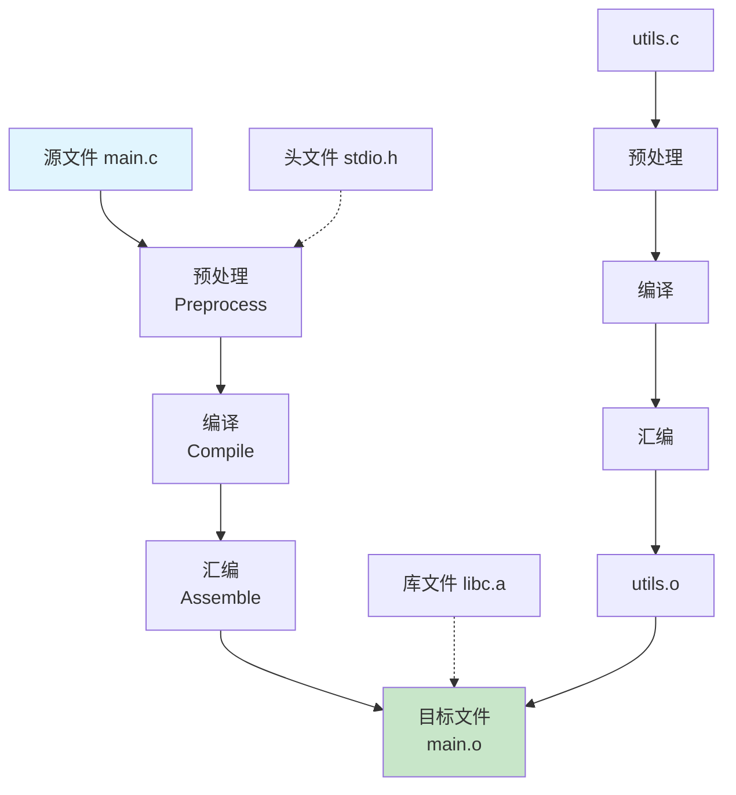

> **English Version**: [Compiled Language Build Guide: A Deep Dive into C/C++ Build Process](./README.md)

# 编译型语言项目构建指南：以C/C++为例

> 每当你执行 `gcc main.c -o app` 或 `make` 时，编译器都在背后完成了一系列精密的转换工作。本文将以C/C++为例，带你深入理解编译型语言的完整构建过程。

## 1. 什么是编译型语言

编译型语言（Compiled Language）是指代码在执行前需要先通过编译器将源代码转换为机器码的语言。

**代表语言**：C、C++、Rust、Go


## 2. 构建的四个阶段

### 2.1 完整流程图



### 2.2 预处理阶段（Preprocessing）

预处理是编译前的准备工作，主要处理以 `#` 开头的指令。

**预处理任务**：

| 任务 | 指令 | 说明 |
|------|------|------|
| 宏展开 | `#define` | 替换所有宏定义 |
| 头文件包含 | `#include` | 插入头文件内容 |
| 条件编译 | `#if/#ifdef/#endif` | 根据条件选择性编译 |
| 移除注释 | `//` 和 `/* */` | 删除所有注释 |

**实例演示**：

```c
// main.c
#define MAX_SIZE 100
#define DEBUG 1

#include <stdio.h>

int main() {
    // 这是一条注释
    printf("Max size is: %d\n", MAX_SIZE);
    return 0;
}
```

执行预处理：

```bash
gcc -E main.c -o main.i

# 查看预处理结果（前20行）
head -20 main.i
```

```c
// 预处理后的结果
# 1 "main.c"
# 1 "<built-in>"
# 1 "<command-line>"
...

# 1 "main.c" 2

typedef __builtin_va_list __gnuc_va_list;
typedef __gnuc_va_list va_list;

extern int printf (const char *__restrict__, ...);
int main() {
    printf("Max size is: %d\n", 100);
    return 0;
}
```

### 2.3 编译阶段（Compilation）

编译阶段将预处理后的代码转换为汇编语言。

```bash
# 从预处理文件生成汇编代码
gcc -S main.i -o main.s

# 或一步完成预处理+编译
gcc -S main.c -o main.s
```

**汇编文件示例**（main.s）：

```asm
    .file   "main.c"
    .text
    .def    __mingw_main;    .scl    2;  .type   32; .endef
    .globl  main
    .def    main;           .scl    2;  .type   32; .endef
    .seh_proc   main
main:
    pushq   %rbp
    .seh_pushreg   %rbp
    movq    %rsp, %rbp
    .seh_setframe  %rbp, 0
    subq    $32, %rsp
    .seh_allocstack 32
    ...

    leaq    .LC0(%rip), %rcx
    movl    $100, %edx
    call    printf
    xorl    %eax, %eax

    addq    $32, %rsp
    popq    %rbp
    ret
    .seh_endproc
```

### 2.4 汇编阶段（Assembly）

汇编器将汇编代码转换为机器码，生成目标文件（Object File）。

```bash
# 从汇编文件生成目标文件
gcc -c main.s -o main.o

# 或一步完成编译+汇编
gcc -c main.c -o main.o
```

**目标文件结构**：

```
+------------------+
|  文件头          |  描述文件类型、机器架构
+------------------+
|  符号表          |  函数和变量定义
+------------------+
|  重定位表        |  链接时需要处理的位置
+------------------+
|  代码段 (.text)  |  机器指令
+------------------+
|  数据段 (.data)  |  已初始化的全局变量
+------------------+
|  BSS段 (.bss)   |  未初始化的全局变量
+------------------+
```

### 2.5 链接阶段（Linking）

链接器将多个目标文件和库文件合并成最终的可执行文件。

```bash
# 链接单个目标文件
gcc main.o -o main

# 链接多个目标文件
gcc main.o utils.o -o app

# 链接静态库
gcc main.o -L/usr/lib -lm -o main

# 链接动态库
gcc main.o -lpthread -o main
```

**链接类型对比**：

| 类型 | 静态链接 | 动态链接 |
|------|----------|----------|
| 库代码位置 | 嵌入可执行文件 | 运行时加载 |
| 文件大小 | 较大 | 较小 |
| 更新维护 | 需重新编译 | 可单独更新库 |
| 启动速度 | 较快 | 略慢 |

## 3. 一步式构建

实际使用中，通常直接一步完成所有阶段：

```bash
# 最简构建
gcc main.c -o main

# 带调试信息
gcc -g main.c -o main_debug

# 优化构建
gcc -O2 main.c -o main_optimized

# 带所有警告
gcc -Wall -Wextra main.c -o main
```

**常用编译选项**：

| 选项 | 说明 | 示例 |
|------|------|------|
| `-o` | 指定输出文件名 | `-o app` |
| `-c` | 只编译不链接 | `-c main.c` |
| `-g` | 生成调试信息 | `-g main.c` |
| `-O[n]` | 优化级别 | `-O2 main.c` |
| `-Wall` | 启用所有警告 | `-Wall main.c` |
| `-I` | 添加头文件搜索路径 | `-I./include` |
| `-L` | 添加库文件搜索路径 | `-L./lib` |
| `-l` | 指定要链接的库 | `-lm` (math) |

## 4. 多文件项目构建

### 4.1 项目结构

```
project/
├── include/
│   ├── utils.h
│   └── config.h
├── src/
│   ├── main.c
│   ├── utils.c
│   └── config.c
├── lib/
│   └── libcustom.a
└── build/
```

### 4.2 头文件与源文件分离

```c
// include/utils.h
#ifndef UTILS_H
#define UTILS_H

// 函数声明
int add(int a, int b);
int multiply(int a, int b);
void print_result(int result);

#endif
```

```c
// src/utils.c
#include "utils.h"

int add(int a, int b) {
    return a + b;
}

int multiply(int a, int b) {
    return a * b;
}

void print_result(int result) {
    printf("Result: %d\n", result);
}
```

```c
// src/main.c
#include "utils.h"

int main() {
    int sum = add(5, 3);
    int product = multiply(4, 6);
    
    print_result(sum);
    print_result(product);
    
    return 0;
}
```

### 4.3 手动编译多文件

```bash
# 编译所有源文件
gcc -c src/main.c -o build/main.o -I./include
gcc -c src/utils.c -o build/utils.o -I./include

# 链接生成可执行文件
gcc build/main.o build/utils.o -o build/app

# 或一步完成
gcc src/*.c -I./include -o build/app
```

## 5. 使用 Makefile 管理构建

Makefile 是管理大型项目构建的标准工具，能自动追踪文件依赖，只重新编译修改过的部分。

### 5.1 基础 Makefile

```makefile
# 变量定义
CC = gcc
CFLAGS = -Wall -g -I./include
TARGET = app
SRCS = src/main.c src/utils.c
OBJS = $(SRCS:.c=.o)

# 默认目标
all: $(TARGET)

# 链接生成可执行文件
$(TARGET): $(OBJS)
    $(CC) $(CFLAGS) -o $@ $^

# 编译规则：.c -> .o
%.o: %.c
    $(CC) $(CFLAGS) -c $< -o $@

# 清理
clean:
    rm -f $(OBJS) $(TARGET)

# 伪目标声明
.PHONY: all clean
```

**Makefile 变量说明**：

| 变量 | 说明 | 示例 |
|------|------|------|
| `$@` | 目标文件名 | `app` |
| `$<` | 第一个依赖文件名 | `main.c` |
| `$^` | 所有依赖文件 | `main.o utils.o` |

### 5.2 进阶 Makefile

```makefile
# ==================== 配置 ====================
CC = gcc
CXX = g++
CFLAGS = -Wall -Wextra -O2
CXXFLAGS = -std=c++17 $(CFLAGS)
LDFLAGS = -L./lib
LDLIBS = -lm -lpthread

# 目录
SRC_DIR = src
INC_DIR = include
OBJ_DIR = build
BIN_DIR = bin

# 源文件、目标文件、可执行文件
SOURCES = $(wildcard $(SRC_DIR)/*.c)
OBJECTS = $(SOURCES:$(SRC_DIR)/%.c=$(OBJ_DIR)/%.o)
TARGET = $(BIN_DIR)/app

# ==================== 规则 ====================
.PHONY: all clean rebuild test install

all: $(TARGET)
    @echo "构建完成: $(TARGET)"

$(TARGET): $(OBJECTS) | $(BIN_DIR)
    $(CC) $(LDFLAGS) -o $@ $^ $(LDLIBS)

$(OBJ_DIR)/%.o: $(SRC_DIR)/%.c | $(OBJ_DIR)
    $(CC) $(CFLAGS) -I$(INC_DIR) -c $< -o $@

$(OBJ_DIR):
    mkdir -p $(OBJ_DIR)

$(BIN_DIR):
    mkdir -p $(BIN_DIR)

clean:
    rm -rf $(OBJ_DIR) $(BIN_DIR)

rebuild: clean all

test: $(TARGET)
    @echo "运行测试..."
    ./$(TARGET)

install: $(TARGET)
    cp $(TARGET) /usr/local/bin/
    @echo "安装完成"
```

### 5.3 Makefile 使用

```bash
# 基本构建
make

# 清理后重新构建
make rebuild

# 只编译修改的文件
make

# 清理
make clean
```

## 6. 使用 CMake 构建

CMake 是一个跨平台的构建系统，能生成各平台的原生构建文件（Makefile、Visual Studio 项目等）。

### 6.1 CMakeLists.txt 基础

```cmake
# 最低 CMake 版本要求
cmake_minimum_required(VERSION 3.20)

# 项目信息
project(MyApp VERSION 1.0.0 LANGUAGES C)

# 设置 C 标准
set(CMAKE_C_STANDARD 11)
set(CMAKE_C_STANDARD_REQUIRED ON)

# 搜索源文件
file(GLOB SOURCES "${CMAKE_SOURCE_DIR}/src/*.c")

# 创建可执行文件
add_executable(${PROJECT_NAME} ${SOURCES})

# 包含头文件目录
target_include_directories(${PROJECT_NAME} PRIVATE
    ${CMAKE_SOURCE_DIR}/include
)

# 编译选项
target_compile_options(${PROJECT_NAME} PRIVATE
    -Wall -Wextra -O2
)

# 链接库
target_link_libraries(${PROJECT_NAME} PRIVATE
    m pthread
)
```

### 6.2 CMakeLists.txt 进阶

```cmake
cmake_minimum_required(VERSION 3.20)
project(MyApp VERSION 1.0.0)

# ==================== 配置 ====================
set(CMAKE_C_STANDARD 11)
set(CMAKE_RUNTIME_OUTPUT_DIRECTORY ${CMAKE_BINARY_DIR}/bin)
set(CMAKE_LIBRARY_OUTPUT_DIRECTORY ${CMAKE_BINARY_DIR}/lib)

# 查找依赖包
find_package(OpenSSL REQUIRED)
find_package(Threads REQUIRED)

# ==================== 源文件 ====================
include_directories(${CMAKE_SOURCE_DIR}/include)

add_subdirectory(src/utils)
add_subdirectory(src/main)

# 主程序
add_executable(${PROJECT_NAME}
    src/main/main.c
)

# ==================== 链接 ====================
target_link_libraries(${PROJECT_NAME}
    utils
    OpenSSL::SSL
    OpenSSL::Crypto
    Threads::Threads
)

# ==================== 安装 ====================
install(TARGETS ${PROJECT_NAME}
    RUNTIME DESTINATION bin
)

install(DIRECTORY ${CMAKE_SOURCE_DIR}/config/
    DESTINATION etc/${PROJECT_NAME}
)
```

### 6.3 子目录 CMakeLists（模块化）

```cmake
# src/utils/CMakeLists.txt
add_library(utils STATIC
    utils.c
    math_utils.c
    string_utils.c
)

target_include_directories(utils PUBLIC
    ${CMAKE_SOURCE_DIR}/include
)
```

### 6.4 CMake 构建流程

```bash
# 创建构建目录（不推荐在源码目录构建）
mkdir build && cd build

# 配置项目
cmake .. -DCMAKE_BUILD_TYPE=Release

# 构建
cmake --build .

# 或使用 make
make

# 安装
cmake --install .

# 清理
rm -rf build
```

## 7. 常见问题与解决

### 7.1 编译错误

| 错误 | 原因 | 解决方案 |
|------|------|----------|
| `undefined reference to 'xxx'` | 链接时找不到函数定义 | 添加对应的 `.o` 文件或库 |
| `No such file or directory` | 头文件路径错误 | 使用 `-I` 添加路径 |
| `implicit declaration` | 函数未声明或未包含头文件 | 添加函数声明 |
| `undefined symbol` | 链接了错误版本的库 | 检查库版本 |

### 7.2 链接错误

```bash
# 常见链接库
-lm          # 数学库 libm.so
-lpthread    # 线程库
-lssl        # OpenSSL
-lcrypto     # OpenSSL 加密
-lcurl       # libcurl
```

### 7.3 调试技巧

```bash
# 查看详细的编译命令
make VERBOSE=1

# 查看符号表
nm main.o
readelf -s main.o

# 查看动态库依赖
ldd app
otool -L app  # macOS

# 查看库文件内容
ar -t libutils.a
```

## 8. 最佳实践

### 8.1 项目组织

```
project/
├── CMakeLists.txt
├── Makefile
├── README.md
├── LICENSE
├── include/           # 头文件
│   ├── utils.h
│   └── config.h
├── src/              # 源代码
│   ├── main.c
│   ├── utils.c
│   └── tests/
├── lib/              # 第三方库
├── build/            # 构建输出（不提交到git）
└── .gitignore
```

### 8.2 .gitignore 示例

```
# 构建产物
build/
*.o
*.a
*.so
*.dylib
app
*.exe

# IDE
.vscode/
.idea/

# CMake
CMakeFiles/
CMakeCache.txt
cmake_install.cmake
```

### 8.3 编译脚本

```bash
#!/bin/bash
# build.sh - 跨平台构建脚本

set -e

# 颜色
RED='\033[0;31m'
GREEN='\033[0;32m'
NC='\033[0m'

build() {
    echo -e "${GREEN}[构建]${NC} 开始构建项目..."
    
    if [ -d "build" ]; then
        rm -rf build
    fi
    mkdir -p build
    
    cd build
    cmake .. -DCMAKE_BUILD_TYPE=Release
    cmake --build . -j$(nproc)
    
    echo -e "${GREEN}[完成]${NC} 构建成功！"
}

clean() {
    echo -e "${RED}[清理]${NC} 清理构建目录..."
    rm -rf build
}

"$@"
```

## 9. 总结

### 构建流程回顾

```
源代码(.c) → 预处理 → 编译 → 汇编 → 链接 → 可执行文件
```

| 阶段 | 输入 | 输出 | 工具 |
|------|------|------|------|
| 预处理 | `.c` + `.h` | `.i` | cpp |
| 编译 | `.i` | `.s` | gcc/cc |
| 汇编 | `.s` | `.o` | as |
| 链接 | `.o` | 可执行文件 | ld |

### 关键要点

1. **理解四阶段**：预处理、编译、汇编、链接缺一不可
2. **使用 Makefile**：管理复杂项目的首选方案
3. **CMake 跨平台**：大型项目的标准化构建系统
4. **善用工具**：善用 `-Wall`、调试符号、链接库选项

---

## 参考资料

1. [GCC Manual](https://gcc.gnu.org/onlinedocs/gcc/)
2. [GNU Make Manual](https://www.gnu.org/software/make/manual/)
3. [CMake Tutorial](https://cmake.org/cmake/help/latest/guide/tutorial/index.html)
4. 《深入理解计算机系统》（Computer Systems: A Programmer's Perspective）

---

*如有问题，欢迎交流讨论！*